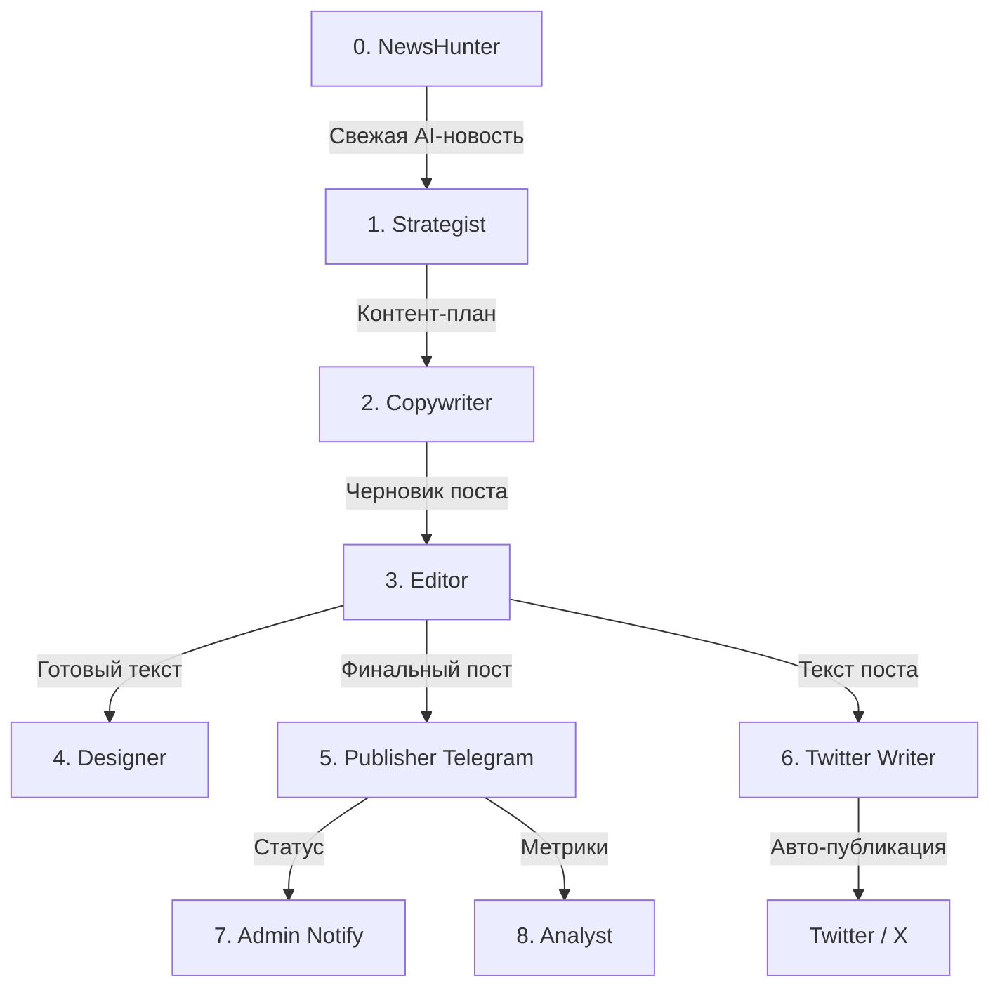

# 🤖 AI Affiliate & Growth Agents (v2.0)

Автономная мультиагентная система на Python для ведения Telegram-канала про нейросети и привлечения живого трафика из Twitter/X.

---

## 🌟 Ключевые возможности

1. **📰 NewsHunter (Поиск свежих AI-новостей)**
   - Автоматически парсит тренды и горячие новости с **Hacker News** и тематических сабреддитов **Reddit** (`r/MachineLearning`, `r/ChatGPT`, `r/singularity`, `r/LocalLLaMA`).
   - Работает **без API-ключей** и абсолютно бесплатно.
   - Фильтрует по релевантности к AI/LLM и выбирает самую свежую новость дня.

2. **✍️ Живой копирайтинг (Growth Mode)**
   - Посты пишутся от лица реального человека (без рекламных клише, без сухости).
   - 10 чередующихся форматов контента (новости, разборы, кейсы, лайфхаки, подборки).
   - Органичный CTA с призывом подписаться на Telegram-канал.

3. **🐦 Автопостинг в Twitter/X (Воронка лидов)**
   - Генерирует вирусные твиты с интригующим Hook.
   - Автоматически публикует через Twitter API v2 (OAuth 1.0a).
   - Ссылка в твите ведет на ваш Telegram-канал.

4. **🛡️ Защита от сбоев и дублей**
   - Fallback AI: Gemini 2.0 Flash → Groq LLaMA 3.3 70B.
   - Защита от повторной публикации в один и тот же день.
   - 30% постов выходят без картинки для максимально органичного и нативного вида.

---

## 🏗️ Архитектура агентов



---

## ⚙️ Режимы работы (`PIPELINE_MODE`)

Вы можете переключать режим в `.env` или GitHub Actions:

- `PIPELINE_MODE=growth` *(по умолчанию)*:
  - Фокус на наборе подписчиков.
  - Посты на основе свежих новостей и лайфхаков.
  - Ссылки ведут на ваш Telegram-канал (`t.me/...`).
- `PIPELINE_MODE=affiliate`:
  - Фокус на монетизации.
  - Посты с обзорами партнерских сервисов из `config/partners.yaml`.
  - Ссылки ведут на партнерские программы с дисклеймером.

---

## 🔑 Настройка секретов в GitHub Repository Secrets

Для автоматической работы 2 раза в день через GitHub Actions:
Откройте репозиторий на GitHub → **Settings** → **Secrets and variables** → **Actions** → **New repository secret**:

| Secret Name | Описание | Обязательно |
|---|---|---|
| `GH_PAT` | Personal Access Token с правами `repo` (для сохранения логов) | Да |
| `GEMINI_API_KEY` | Ключ Google AI Studio ([aistudio.google.com](https://aistudio.google.com/)) | Да (или Groq) |
| `GROQ_API_KEY` | Ключ Groq Cloud ([console.groq.com](https://console.groq.com/)) | Да (fallback) |
| `TELEGRAM_BOT_TOKEN` | Токен бота от @BotFather | Да |
| `TELEGRAM_CHANNEL_ID` | ID канала (например `-100xxxxxxxxxx`) | Да |
| `TELEGRAM_CHANNEL_USERNAME` | Юзернейм канала (например `@nejroavtomatizacia`) | Да |
| `TELEGRAM_OWNER_ID` | Ваш личный Telegram ID | Да |
| `TELEGRAM_ADMIN_CHAT_ID` | Ваш Telegram ID для админ-уведомлений | Опционально |
| `TWITTER_API_KEY` | Twitter Consumer Key (API Key) | Для X |
| `TWITTER_API_SECRET` | Twitter Consumer Secret (API Secret) | Для X |
| `TWITTER_ACCESS_TOKEN` | Twitter Access Token | Для X |
| `TWITTER_ACCESS_SECRET` | Twitter Access Token Secret | Для X |

> ⚠️ **Важно для Twitter/X:** В настройках приложения на [developer.twitter.com](https://developer.twitter.com) в разделе **User authentication settings** обязательно укажите права **Read and Write**.

---

## 🚀 Ручной запуск и тестирование

```bash
# 1. Установка зависимостей
pip install -r requirements.txt

# 2. Создание файла с переменными окружения
cp .env.example .env
# Заполните .env своими ключами

# 3. Тест поиска новостей
python -m src.agents.news_hunter

# 4. Тест генерации контент-плана
python -m src.agents.strategist

# 5. Тест Twitter клиента
python -m src.integrations.x_client

# 6. Полный запуск пайплайна
python -m src.main

# 7. Просмотр отчета
python -m src.main report
```
